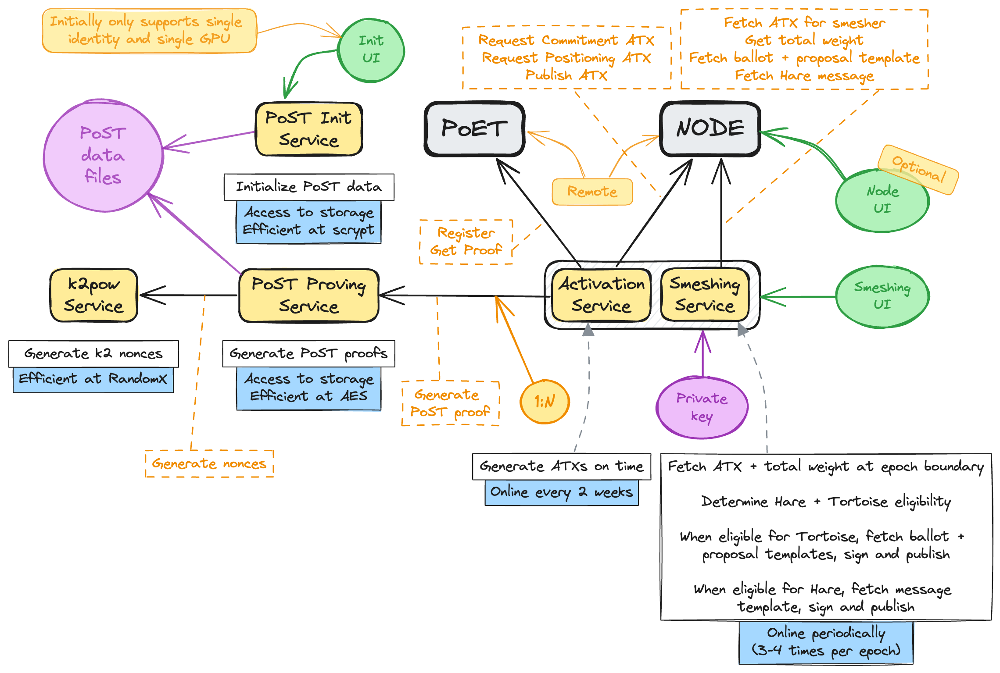

# Node split PoC

In our ongoing effort to lower the bar for smeshing, we're exploring a new direction for reducing system requirements for smeshers. The idea is to re-architect the internal modules in go-spacemesh, isolating the smeshing logic from the passive consensus code. By dividing the node along these lines, we can enable users to run the lightweight yet sensitive (requiring access to private key) smeshing logic separately from the rest of the node. This allows users with limited resources to use a remote node for their smeshing.

We are demonstrating a PoC of the node split, where the smeshing logic is separated from the rest of the node. The PoC is based on the current go-spacemesh codebase and is intended to demonstrate the feasibility of the node split concept. The PoC is not intended to be a production-ready implementation.

The architecture of the PoC is as follows:



The PoC consists of two separate processes:
* `node service` aka node
* `smesher service` aka client

The easiest way to understand the setup is to try the PoC yourself. The following instructions will guide you through the process.


## Running the PoC

There are two distinct configuration/setup methods possible:
1. Using locally running node and smesher service
2. Using remote running node and local smesher service

We will use a Docker Compose based setup for both options. While it's possible to run the PoC without Docker, it's more complicated, so for simplicity we'll use Docker.

Both setups will run two smesher services connecting to the same node. Please note that one smesher service can have multiple post services connected to it, as is currently the case with node and post services. However, in this PoC we're using only one post service per smesher service.

### Using locally running node and smesher service

Please use the `docker-compose-testnet-both-local.yml` file for this setup.

The commands will be:
```
docker-compose -f docker-compose-testnet-both-local.yml [...]
```

Since this will be a locally running node, it will need to sync with the network like all Spacemesh nodes. The testnet network is small, so the node should sync relatively quickly.


### Using remote running node and local smesher service

Please use the `docker-compose-testnet-remote-node.yml` file for this setup.

The commands will be:
```
docker-compose -f docker-compose-testnet-remote-node.yml [...]
```

### Starting the setup

1. Clone the repository and switch to the `node-split-poc` branch
```
git clone https://github.com/spacemeshos/go-spacemesh.git
git checkout node-split-poc
```
2. Change directory to the repository and demo directory
```
cd go-spacemesh/activation_service_poc/demo
```
3. You should see the following files in the directory
```
docker-compose-testnet-both-local.yml
docker-compose-testnet-remote-node.yml
```
4. Run the docker-compose command according to your chosen setup. For example, to run the setup with locally running node and smesher service, run:
```
docker-compose -f docker-compose-testnet-both-local.yml up -d
```


If all steps are followed correctly, you should see three new Docker containers running. You can check the status of the containers using:
```
docker compose ps
```
//TODO add the output of the command @pigmej


You'll also be able to connect to the node's UI by visiting `https://https://smesher-alpha.spacemesh.network/` in your browser. This is a PoC of the smesher service UI and is not intended to be a production-ready implementation. It uses the smesher service API directly to interact with the smesher service. It's fully open source and the code can be found [here](https://github.com/spacemeshos/smesher-app).
//TODO make sure that it actually is opened publicly already @pigmej

The first time you open the UI it will be mostly empty as you're running a fresh smeshing service and therefore don't yet have eligibility. Testnet epochs are 24 hours long, so you'll need to wait for the next epoch to start smeshing. You can check the epoch number and exact timing in the UI.

After a few epochs you should see a UI that looks similar to:


## Interacting with the PoC

The smesher service proxies v2 API calls to the node service. You can query the smesher service API to interact with the attached node. For example:
```
curl -X POST http://localhost:19171/spacemesh.v2alpha1.NodeService/Status
```
will return the node's status.

In addition to the existing v2 API, there is `spacemesh.v2alpha1.SmeshingIdentitiesService/States` which returns the list of smeshing identities and their detailed states.

>[!NOTE]
Please note that currently the state persistence is implemented with some simplifications. States persist across restarts but you will see some duplicates in the list of states. This is a known issue that will be fixed in the final implementation.
