<!-- markdown-toc start - Don't edit this section. Run M-x markdown-toc-refresh-toc -->
**Table of Contents**

- [Set Reconciliation Protocol (sync2)](#set-reconciliation-protocol-sync2)
    - [Basic concepts](#basic-concepts)
    - [Simplified set reconciliation example](#simplified-set-reconciliation-example)
    - [Attack mitigation](#attack-mitigation)
    - [Range representation](#range-representation)
    - [MinHash-based set difference estimation](#minhash-based-set-difference-estimation)
    - [Recent sync](#recent-sync)
    - [Message types](#message-types)
        - [Round messages](#round-messages)
            - [Done message](#done-message)
            - [EndRound message](#endround-message)
        - [Set reconciliation messages](#set-reconciliation-messages)
            - [EmptySet message](#emptyset-message)
            - [EmptyRange message](#emptyrange-message)
            - [Fingerprint message](#fingerprint-message)
            - [RangeContents message](#rangecontents-message)
            - [ItemBatch message](#itembatch-message)
        - [MinHash messages](#minhash-messages)
            - [Probe message](#probe-message)
            - [Sample message](#sample-message)
        - [Recent message](#recent-message)
    - [Sync sequences with initiation](#sync-sequences-with-initiation)
    - [Possible improvements](#possible-improvements)
        - [Redundant ItemChunk messages](#redundant-itemchunk-messages)
        - [Range checksums](#range-checksums)
        - [Bloom filters for recent sync](#bloom-filters-for-recent-sync)

<!-- markdown-toc end -->

# Set Reconciliation Protocol (sync2)

The recursive set reconciliation protocol described in this document is based on
[Range-Based Set Reconciliation](https://arxiv.org/pdf/2212.13567.pdf) paper by Aljoscha Meyer.

The multi-peer reconciliation approach is loosely based on
[SREP: Out-Of-Band Sync of Transaction Pools for Large-Scale Blockchains](https://people.bu.edu/staro/2023-ICBC-Novak.pdf)
paper by Novak Boškov, Sevval Simsek, Ari Trachtenberg, and David Starobinski.

## Basic concepts

The set reconciliation protocol is intended to synchronize **ordered sets**.
An **orrered set** provides possibility to compare its
elements, and consequently, elements can be retrieved in order from the set.
Formally, the kind of ordered sets syncv2 can synchronize is called
_totally ordered sets_.

The elements of the sets are actually keys, hash-based IDs of actual
entities such as ATXs. The actual entities are transferred separately
after the sets have been synchronized.

**Range** specifies continuous subranges in the ordered set with
defined bounds. The algorithm works by recursively subdividing the
ordered set into ranges, for which fingerprints are calculated.

**Fingerprint** is used to check if the range with the same bounds
contains the same elements in two sets belonging to different peers.
If fingerprint of a range is the same for both peers, their sets are
considered equal. The fingerprints are calculated by XORing together
the elements (keys) in the set.

The set reconciler uses an optimized data structure that makes
fingerprint calculations cost `O(log n)` under most circumstances.
It will be discussed separately.

## Simplified set reconciliation example

Synchronization of ordered sets is done using range fingerprints and
an interactive stateless protocol.

The latter means that response(s) to each message, if any, are
generated solely based on that message and the local set and not based
on any previous messages. The exception to that rule is
[Done](#done-message) and [EndRound](#end-round-message) messages (see
corresponding sections below).

Below is an illustration of simplified reconciliation between two sets.
Let's assume that the items are mere bytes, fingerprints being these
bytes XORed together.

The range representation used for this example is simplified, with
proper range representation being discussed in following sections.
For now, let's just describe ranges using inclusive notation,
0x00..0xff meaning all the values from 0x00 up to and including 0xff.

1. Initially, the fingerprint of the whole set is sent from A to B.
2. Checking the fingerprint of its set, B finds out that A has a
   different fingerprint, and thus splits the whole range of elements
   in two subranges, calculating fingerprints for them and sending
   these fingerprints back to A.
3. A finds out that the fingerprint for the 0x00..0x7f subrange, 0x33,
   is the same as the fingerprint received for the same subrange from
   B; thus, 0x00..0x7f subrange is considered synchronized and no
   response is sent back.
4. The 0x80..0xff range, on the other hand, has different fingerprints
   on A and B side. Because of that, A recursively subdivides the
   0x80..0xff range into 0x80..0xbf and 0xc0..0xff ranges, calculates
   the fingerprints of these new ranges and sends the range boundaries
   together with the fingerprints to B.
5. B notices that the fingerprint for 0x80..0xbf is the same on its
   side, so 0x80..0xbf range is considered synchronized.
6. The subrange 0xc0..0xff has a different fingerprint on the B side,
   but the number of elements in it (2) is small enough, so instead of
   further subdivision we can just send all the items in that range to
   A, together with the range boundaries.
7. Having received the items for the 0xc0..0xff range, A sends all the
   elements it has that fall within that range back to B.
8. At this point, the sets are considered to be in sync.

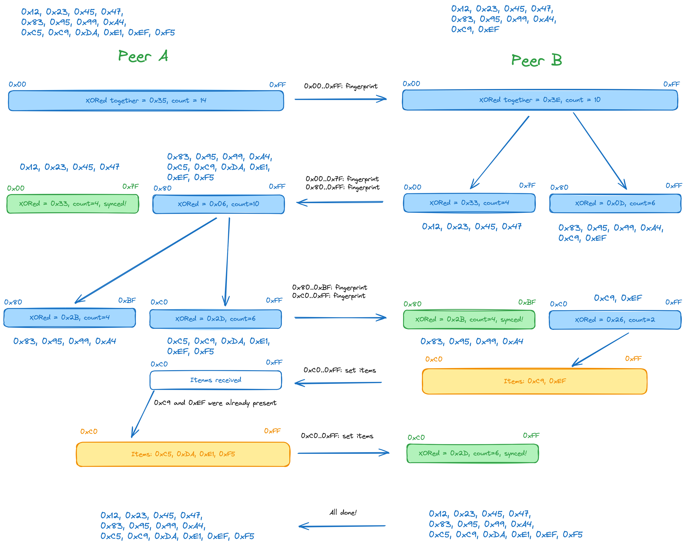

## Attack mitigation

The following is done to mitigate possible attacks against set
reconciliation algorithm:
* do not distribute freshly synced data before validation
* drop peers that provide data that can't pass validation, or do not
  provide the actual entities after sending their IDs. This in
  particular makes it much harder to forge invalid IDs that may cause
  fingerprint collisions
* limit the number of messages and the amount of data transferred

Later, we may also add some more checks, such as detecting unexpected
messages, such as sending the fingerprint for the same range over and
over again.

## Range representation

An intuitive choice for range representation within the ordered set
would be `[a,b]` (from a to b inclusive).  But say we want to divide
on a middle point `m`. Then we will have `[a,m-1]` and `[m,b]`, so we
will also need item decrement operation to be defined the items in the
set. Another problem is, how to represent a range that covers the
whole set? We'd have to use `MIN` and `MAX` to be able to use
`[MIN,MAX]` as such a range representation.

Actually, with set keys being defined as fixed length byte sequences,
these difficulties are not overly important; yet for now, the
reconciler uses the range notation from the original "Range-Based Set
Reconciliation" paper.

The notation we use is `[a,b)`, that is the `a` bound is inclusive and
the `b` is non-inclusive.

There's a catch, though: wraparound ranges. There are following kinds
of ranges:
* if `a < b`: "normal" range
* if `a > b`: "wraparound" ("inverse") range `[a,b)` represents
  `[MIN,a) ∪ [b,MAX]`
* `[a,a)` represents the whole range (that's actually just a special
  case of the wraparound range)

The following diagram shows different types of ranges, and also
illustrates how the ranges can be subdivided into smaller ones, with
dashed lines marking "middle" subdivision points which are used by
the set reconciler to split the ranges recursively.
Note that subdivisions of the ranges are done based on the N of
elements, so not necessarily close to `(a+b)/2`.

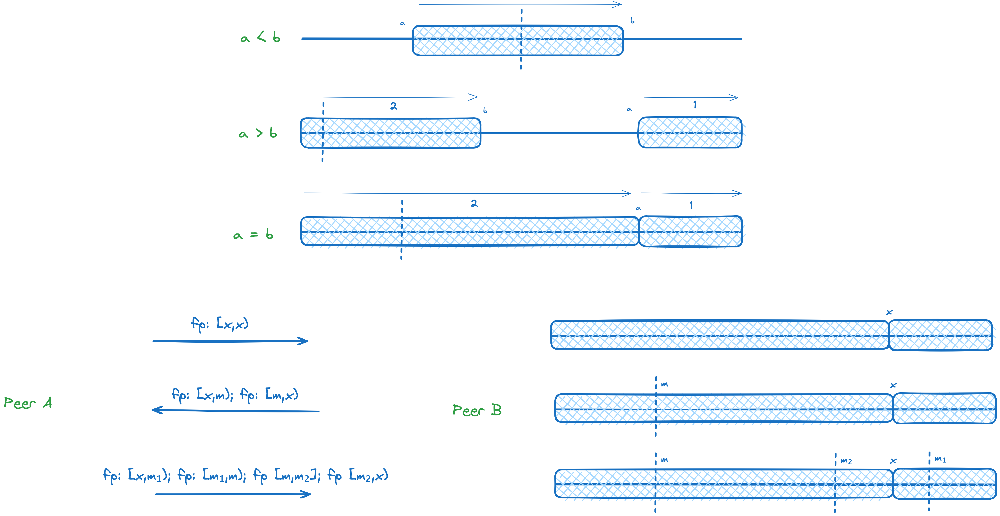

## MinHash-based set difference estimation

The recursive reconciliation algorithm, when used with randomly
distributed element values (such as hash IDs), is only efficient for
relatively small difference between the sets, probably around a few %.
Above that, sending the whole range contents is often a better
strategy. The resulting extra load on the network can be distributed
between multiple peers by asking the different peers for the contents
of different subranges.

Thus, we need a method to gauge the difference between the local set
and the remote one. Using mere item count for this may often be
imprecise, as there can be situations where sets may have similar
counts yet different elements.

Currently, [MinHash](https://en.wikipedia.org/wiki/MinHash) probing is used to
approximate [Jaccard similarity coefficient](https://en.wikipedia.org/wiki/Jaccard_index)
(Jaccard index) between sets belonging to different peers:
```
J(A, B) = |A∩B| / |A∪B|
```

The approximation is done by picking a sample, that is a fixed number
of lowest-valued items (keys) from the set and comparing it to a
sample with the same number of items from the remote peer.

Unlike most MinHash implementations, we don't need to do the actual
hashing b/c the items in the set (keys) are already hash values.

## Recent sync

During periods when a lot of new items arrive in quick succession
(e.g. ATX IDs during the cycle gaps), the sets differences between
peers may become too large for efficient recursive sync quickly.

As the sync algorithm is still good for fixing small differences
between the sets, we can improve the situation by "priming" the sync,
which means sending all the items received during last N
seconds/minutes before beginning the actual sync. This may mean some
excess items may be sent which are present on both peers, but it also
means that the difference between the sets will be reduced, hopefully
avoiding the "send all items" fallback.

See [Recent message](#recent-message) for the details.

## Message types

The set reconciliation protocol uses a number of different messages
that can be grouped as related to the set reconciliation, MinHash
probing, and recent sync.

Some of the messages listed below are markers which do not carry any
extra information besides the message type.

Different messages have different expectations of possible responses
associated with them:
* no response
* a possible response (0..n messages sent back)
* a required response (1..n messages sent back)

### Round messages

All the messages between synchronizing peers are sent in rounds, each
round except the last one being concluded with `EndRound` marker, and
the last round being concluded with `Done` marker.

In the diagrams provided in the sections following "Round messages",
the round messages `EndRound` and `Done` are omitted for the sake of
simplicity.

#### Done message

This message is sent at the end of reconciliation process by the peer
that has determined that it's in sync with another party. The sync
process terminates with one peer sending `Done` message and another
one receiving it. This message is a marker, that is, it doesn't carry
any extra information.

The condition for the `Done` message being sent is:
* after processing all of the messages from the last round, no
  messages were generated that expect any response.

No response is expected to the `Done` message.

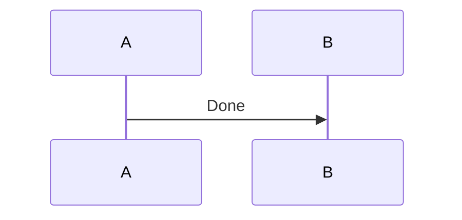
```mermaid
sequenceDiagram
  A->>B: Done
```

#### EndRound message

This message is sent at the end of the reconciliation round, when all
the messages up to and including the `EndRound` message have been
processed and responses sent back. This message is a marker, that is,
it doesn't carry any extra information.

The `EndRound` message is NOT sent after processing all of the peer's
round messages in the following case:
* after processing all of the messages from the last round, no
  messages were generated that expect any response.
In this case, `Done` message is sent instead.

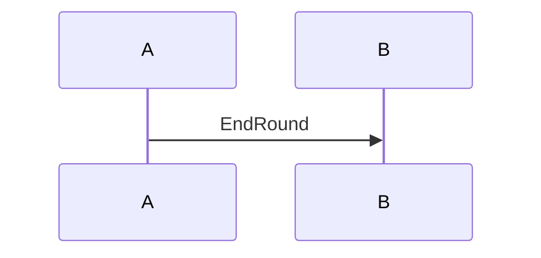
```mermaid
sequenceDiagram
  A->>B: EndRound
```

### Set reconciliation messages

Set reconciliation messages deal with making sure two sets belonging
to different peers `A` and `B` are equal.

#### EmptySet message

This message is sent by a party which doesn't have any items in the
set and no way to pick a bounding value (no bounds were provided to
the reconciler). This message is a marker, that is, it doesn't carry
any extra information.

If the remote peer's set is also empty, the remote peer responds with
`EmptySet` message.
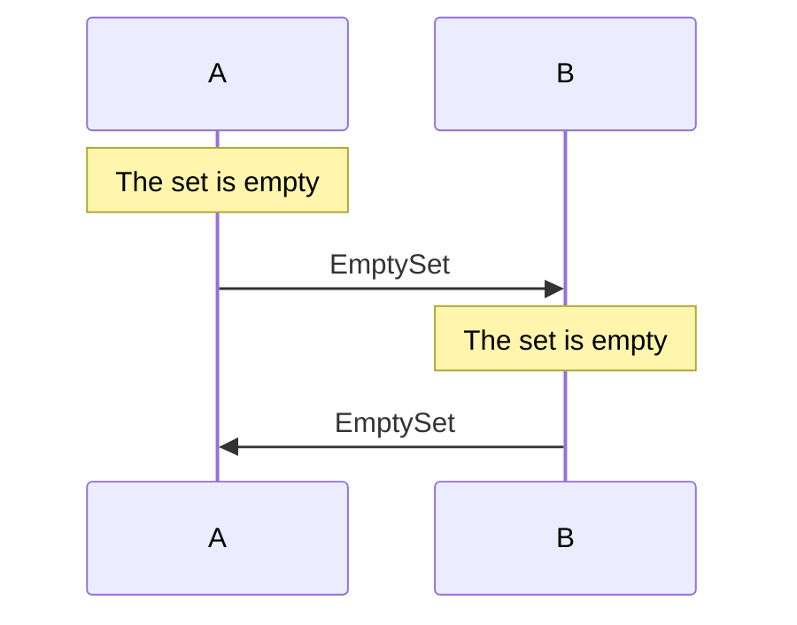
```mermaid
sequenceDiagram
  Note over A: The set is empty
  A->>B: EmptySet
  Note over B: The set is empty
  B->>A: EmptySet
```

If the remote peer's set is not empty, the remote peer sends back its
whole set via a number of `ItemChunk` messages.
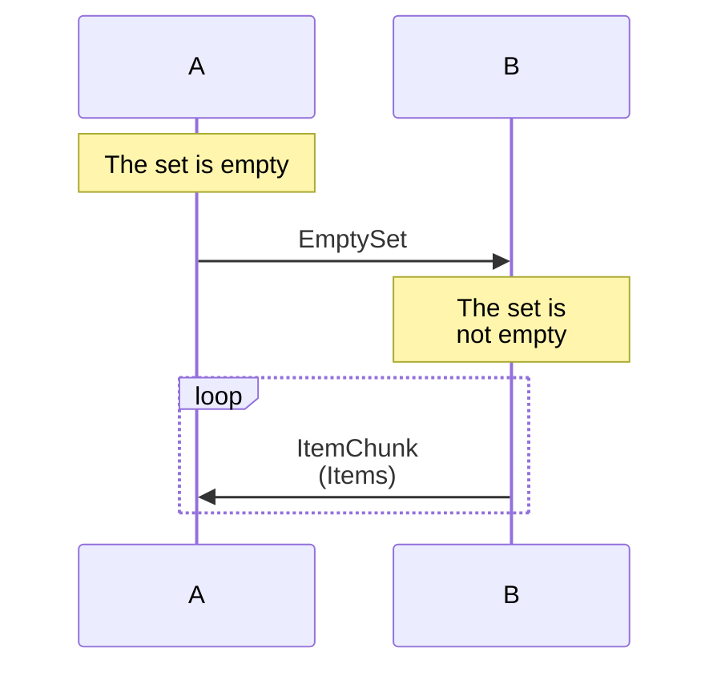
```mermaid
sequenceDiagram
  Note over A: The set is empty
  A->>B: EmptySet
  Note over B: The set is <br/> not empty
  loop
    B->>A: ItemChunk <br/> (Items)
  end
```

#### EmptyRange message

`EmptyRange` message is similar to the `EmptySet` message except that
it applies to a subrange instead of the whole set.

Parameters:
* `X`: start of the range
* `Y`: end of the range

If the remote peer's `[X,Y)` range is also empty, the remote peer
responds with `EmptySet` message.

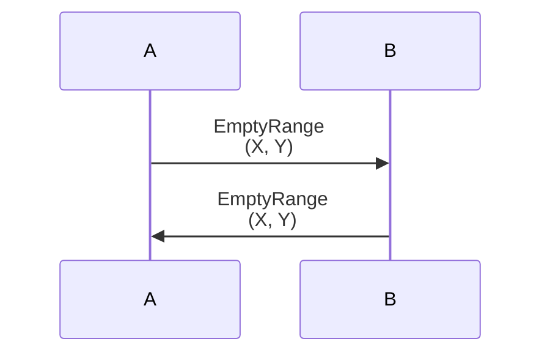
```mermaid
sequenceDiagram
  A->>B: EmptyRange <br/> (X, Y)
  B->>A: EmptyRange <br/> (X, Y)
```

If the remote peer's `[X,Y)` range is not empty, the remote peer
sends back all the items in the range via a number of `ItemChunk`
messages.
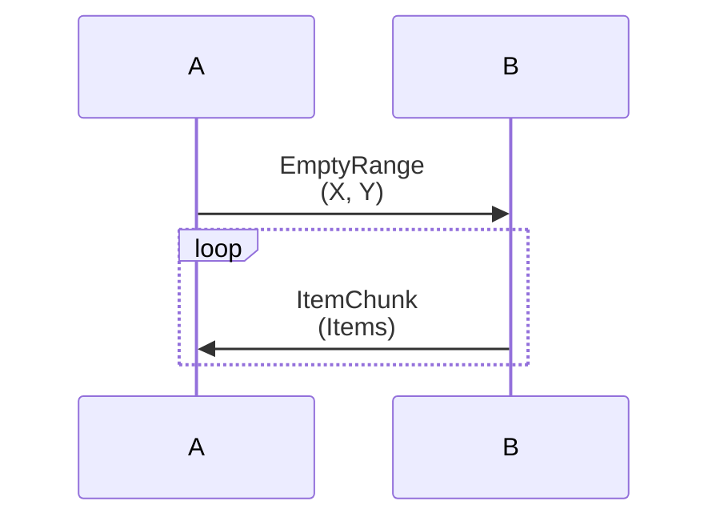
```mermaid
sequenceDiagram
  A->>B: EmptyRange <br/> (X, Y)
  loop
    B->>A: ItemChunk <br/> (Items)
  end
```

#### Fingerprint message

`Fingerprint` message carries the fingerprint and count values for a
specific range. If two ranges with the same `[X,Y)` bounds have the
same fingerprint for both peers, the corresponding bounded subsets are
considered to be equal (in sync).

Parameters:
* `X`: start of the range
* `Y`: end of the range
* `Count`: number of items in the range
* `Fingerprint`: the fingerprint of the range

Upon receiving a `Fingerprint` message for a range for which the local
fingerprint equals to the message's fingerprint value, no response is
generated.
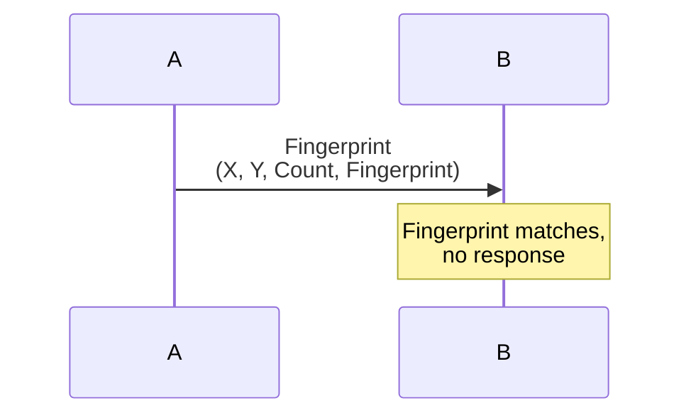
```mermaid
sequenceDiagram
  A->>B: Fingerprint <br/> (X, Y, Count, Fingerprint)
  Note over B: Fingerprint matches, <br/> no response
```

If the fingerprint doesn't match and the range is small enough
(`<=maxSendRange`), the contents of the range is sent back via a
number of `ItemChunk` messages, followed by a `RangeContents` message
which will instruct the peer to send back any items it has in the
`[X,Y)` range.

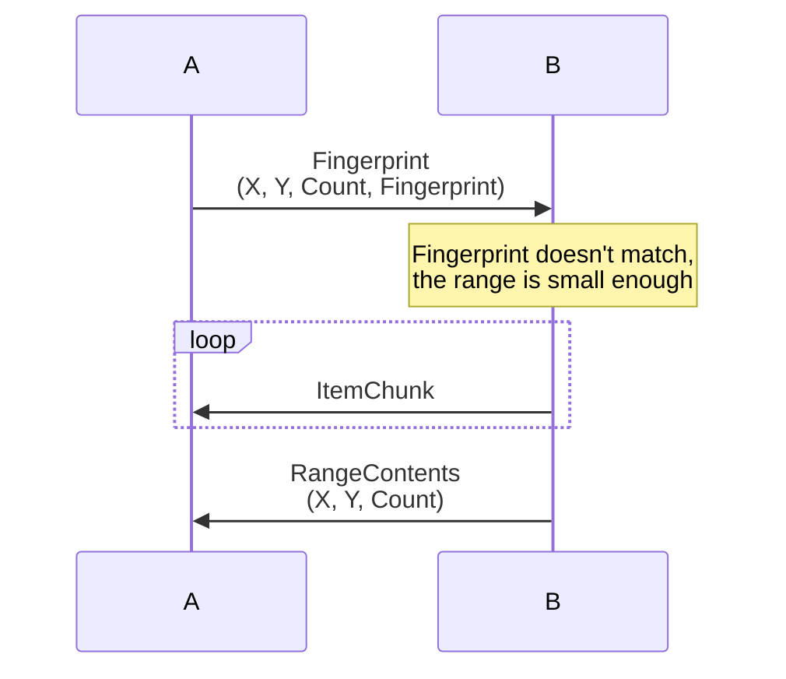
```mermaid
sequenceDiagram
  A->>B: Fingerprint <br/> (X, Y, Count, Fingerprint)
  Note over B: Fingerprint doesn't match, <br/> the range is small enough
  loop
    B->>A: ItemChunk
  end
  B->>A: RangeContents <br/> (X, Y, Count)
```

If the fingerprint doesn't match and the range is big enough
(`>maxSendRange`), the range is split in two using some middle point
`m`, and `Fingerprint` messages are sent back for the each part.

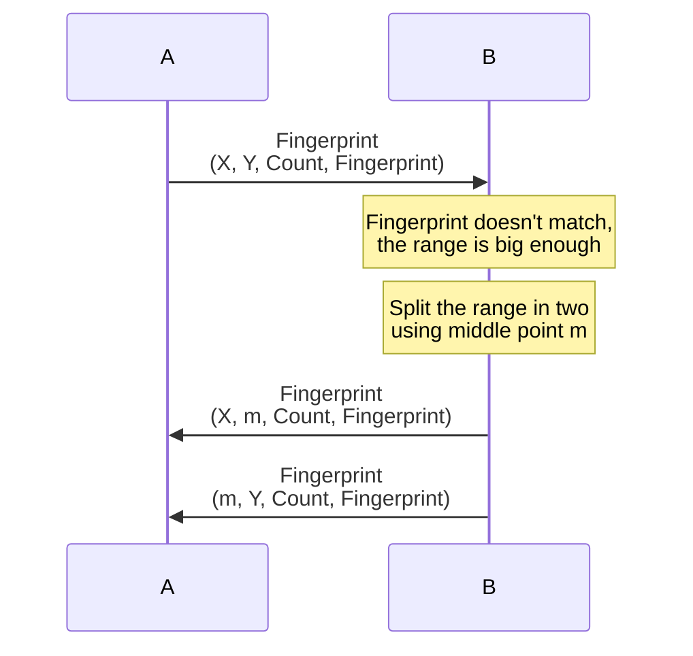
```mermaid
sequenceDiagram
  A->>B: Fingerprint <br/> (X, Y, Count, Fingerprint)
  Note over B: Fingerprint doesn't match, <br/> the range is big enough
  Note over B: Split the range in two <br/> using middle point m
  B->>A: Fingerprint <br/> (X, m, Count, Fingerprint)
  B->>A: Fingerprint <br/> (m, Y, Count, Fingerprint)
```

#### RangeContents message

`RangeContents` message notifies the peer that the contents of the
specific range was sent via `ItemChunk` messages, and requests back
the contents of the range.

Parameters:
* `X`: start of the range
* `Y`: end of the range
* `Count`: number of items in the range

If the local range is empty, no response is generated to `RangeContents`.
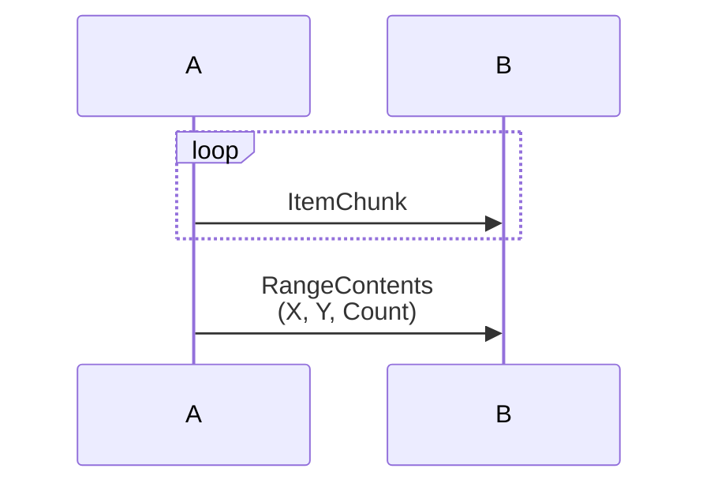
```mermaid
sequenceDiagram
  loop
    A->>B: ItemChunk
  end
  A->>B: RangeContents <br/> (X, Y, Count)
```

If the local range is not empty, the items in the range are sent back
via a number of `ItemChunk` messages.
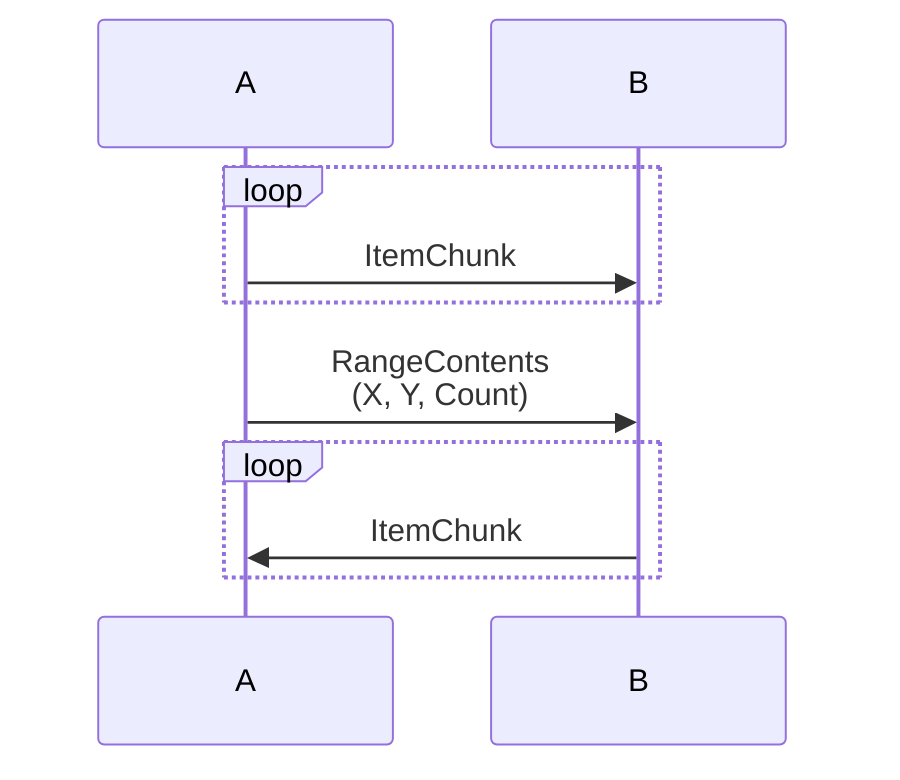
```mermaid
sequenceDiagram
  loop
    A->>B: ItemChunk
  end
  A->>B: RangeContents <br/> (X, Y, Count)
  loop
    B->>A: ItemChunk
  end
```

#### ItemBatch message

`ItemBatch` message contains a number of actual set items (keys).
If the items in the range being sent do not fit into a single
`ItemBatch` message, multiple `ItemBatch` messages are used.
No response is expected.

Parameters:
* `Items`: set items (keys)

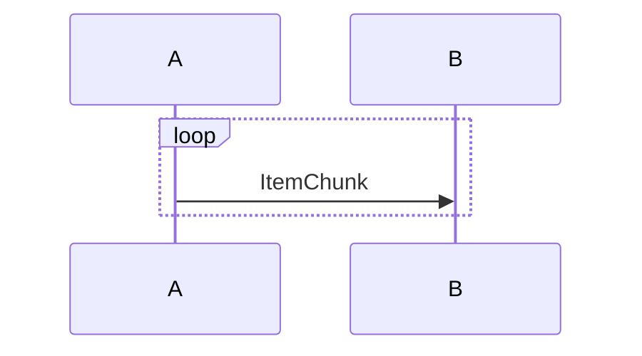
```mermaid
sequenceDiagram
  loop
    A->>B: ItemChunk
  end
```

### MinHash messages

When beginning pairwise set reconciliation, if `WithMaxDiff` option is
used with positive Jaccard distance (`1-J(A,B)`) value, a `Sample`
message is sent so that the peer can decide whether it's set is
similar enough to the other set for efficient recursive reconciliation,
or if "send all items" fallback needs to be used.

Besides that, there's separate probing sequence which is used to
determine the difference between the sets without doing the actual
reconciliation. In this case, a `Probe` message is sent, to which a
`Sample` message is sent by another peer as the response.
Probing is used by the multipeer reconciler to decide on the sync
strategy to use.

#### Probe message

`Probe` message requests a sample of lowest-values items (keys) for
Jaccard index approximation.

Parameters:
* `X`: start of the range
* `Y`: end of the range
* `Fingerprint`: the fingerprint of the range
* `SampleSize`: the number of items in the sample

`Sample` message is always generated as the response to `Probe`
message.

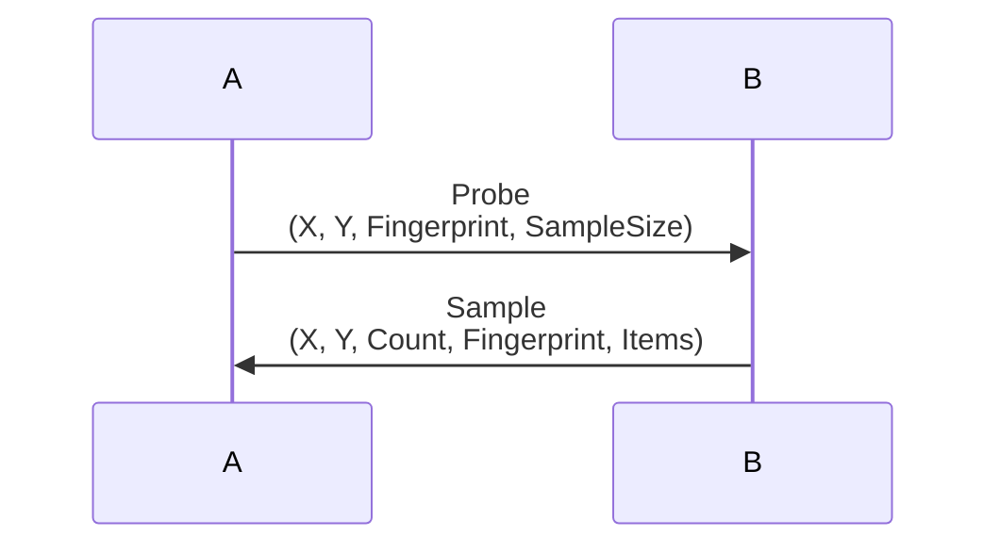
```mermaid
sequenceDiagram
  A->>B: Probe <br> (X, Y, Fingerprint, SampleSize)
  B->>A: Sample <br> (X, Y, Count, Fingerprint, Items)
```

#### Sample message

`Sample` message carries a sample of lowest-valued items (keys) from
the set for Jaccard index approximation. Only a fixed number of lowest
bits from each item is used, b/c collisions are not critical in this
context and may only cause slightly less precise approximation.

Parameters:
* `X`: start of the range
* `Y`: end of the range
* `Fingerprint`: the fingerprint of the range
* `Items`: the actual sample items


During probing, when `Sample` is generated as a response to `Probe`
message, no response is generated.
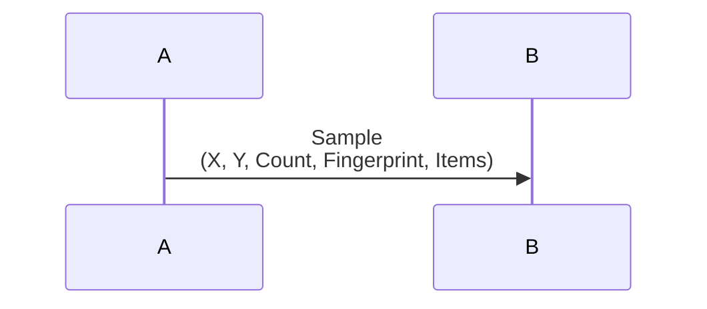
```mermaid
sequenceDiagram
  A->>B: Sample <br> (X, Y, Count, Fingerprint, Items)
```

When `Sample` message is used during sync, the peer receiving the
`Sample` message either sends back all its items in the range if
Jaccard distance exceeds `maxDiff`, along with `RangeContents` message
to request the range contents, or proceeds with normal sync initiation
sequence without further MinHash or recent message processing.  There
can also be a shortcut when the fingerprint value in the `Sample`
message matches that of the same range in the local set, in which
case no responses are generated to the `Sample` message.

The difference is too big:
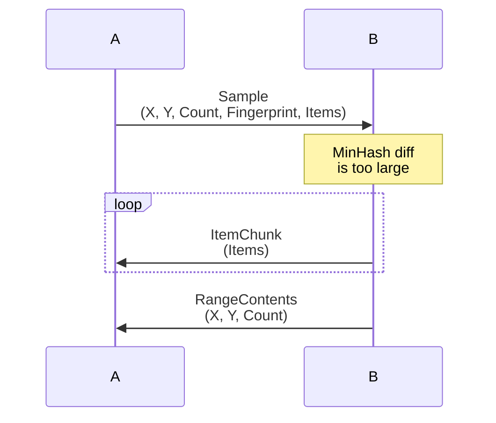
```mermaid
sequenceDiagram
  A->>B: Sample <br/> (X, Y, Count, Fingerprint, Items)
  Note over B: MinHash diff <br/> is too large
  loop
    B->>A: ItemChunk <br/> (Items)
  end
  B->>A: RangeContents <br/> (X, Y, Count)
```

The difference is acceptable:
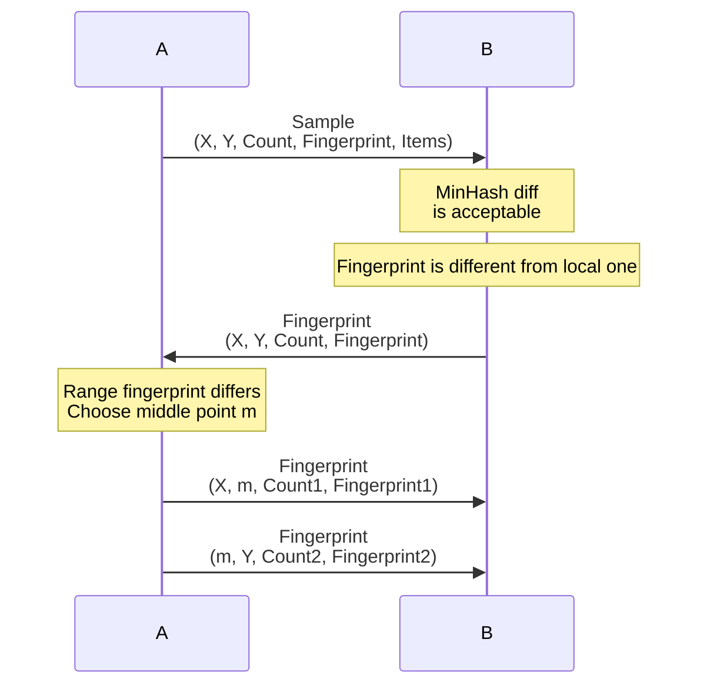
```mermaid
sequenceDiagram
  A->>B: Sample <br/> (X, Y, Count, Fingerprint, Items)
  Note over B: MinHash diff <br/> is acceptable
  Note over B: Fingerprint is different from local one
  B->>A: Fingerprint <br/> (X, Y, Count, Fingerprint)
  Note over A: Range fingerprint differs <br/> Choose middle point m
  A->>B: Fingerprint <br/> (X, m, Count1, Fingerprint1)
  A->>B: Fingerprint <br/> (m, Y, Count2, Fingerprint2)
```

No difference according to the fingerprint:
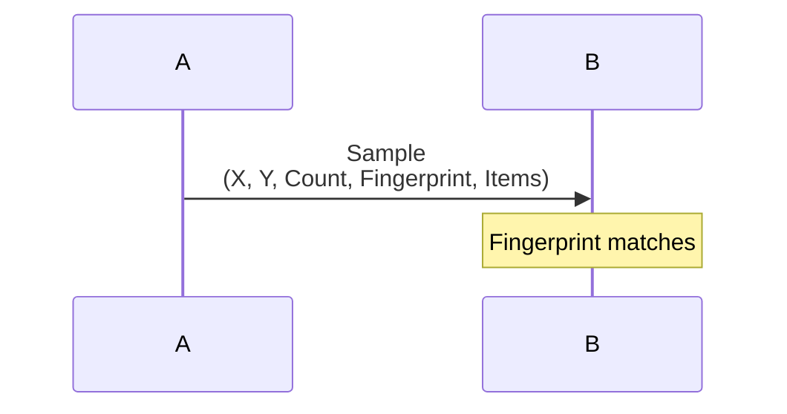
```mermaid
sequenceDiagram
  A->>B: Sample <br/> (X, Y, Count, Fingerprint, Items)
  Note over B: Fingerprint matches
```

### Recent message

This message is used for [Recent sync](#recent-sync). It is sent as
the initial message when recent sync is enabled.

`Recent` message is preceded by a number of `ItemChunk` messages
carrying the actual items (keys). The items in immediately preceding
`ItemChunk` message must be added to the set immediately before
proceeding with further reconciliation.

Parameters:
* `SinceTime`: nanoseconds since Unix epoch marking the beginning of
  recent items that were sent, according to the local timestamp.
  If `SinceTime` is zero, this indicates a response to another Recent
  message.

As a response to `Recent` message, the local items starting from
`SinceTime` according to their local timestamp are sent to the peer
via a number of `ItemChunk` messages, followed by `Recent` message
with zero timestamp, indicating that the items need to be added to the
set immediately before proceeding with further reconciliation. After
that the sync sequence without further `Recent` message but with or
without MinHash probing is initiated, depending on whether a positive
`maxDiff` value is set via the `WithMaxDiff` option.

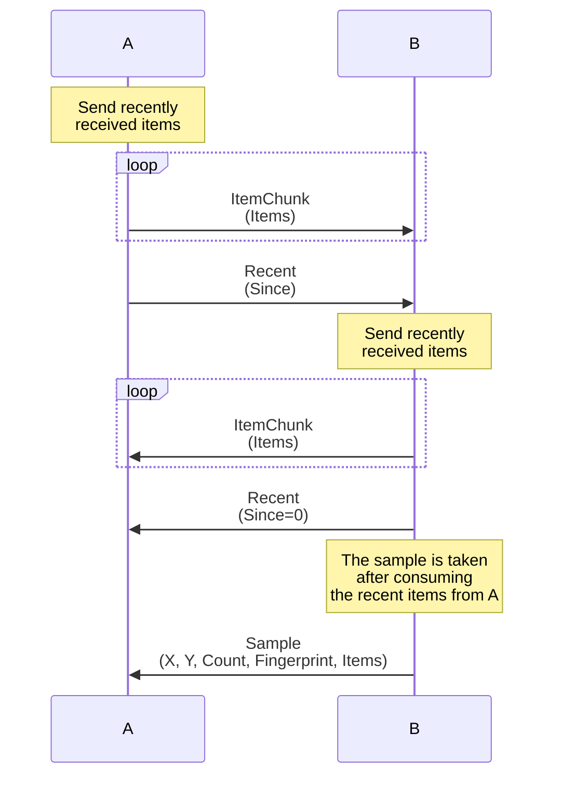
```mermaid
sequenceDiagram
  Note over A: Send recently <br/> received items
  loop
    A->>B: ItemChunk <br/> (Items)
  end
  A->>B: Recent <br/> (Since)
  Note over B: Send recently <br/> received items
  loop
    B->>A: ItemChunk <br/> (Items)
  end
  B->>A: Recent <br/> (Since=0)
  Note over B: The sample is taken <br/> after consuming <br/> the recent items from A
  B->>A: Sample <br/> (X, Y, Count, Fingerprint, Items)
```

## Sync sequences with initiation

The sync initiation sequences outlined below depend on the set contents
as well as on the set reconciliation options, in particular:
* `WithMaxSendRange`: max range size to send w/o any further
  recursive reconciliation
* `WithMaxDiff`: max Jaccard distance (`1-J(A,B)`, `J(A,B)`
  being the approximation of Jaccard index) to be considered for
  further recursive reconciliation. The MinHash check is only
  performed when this option is set to a positive value.
* `WithRecentTimeSpan`: max time span for sending recent
  items. Setting this enables sending `Recent` messages.

Sync between two empty sets or empty ranges. An `EmptySet` message is
used when the set is empty and thus bounding values cannot be chosen
from it.

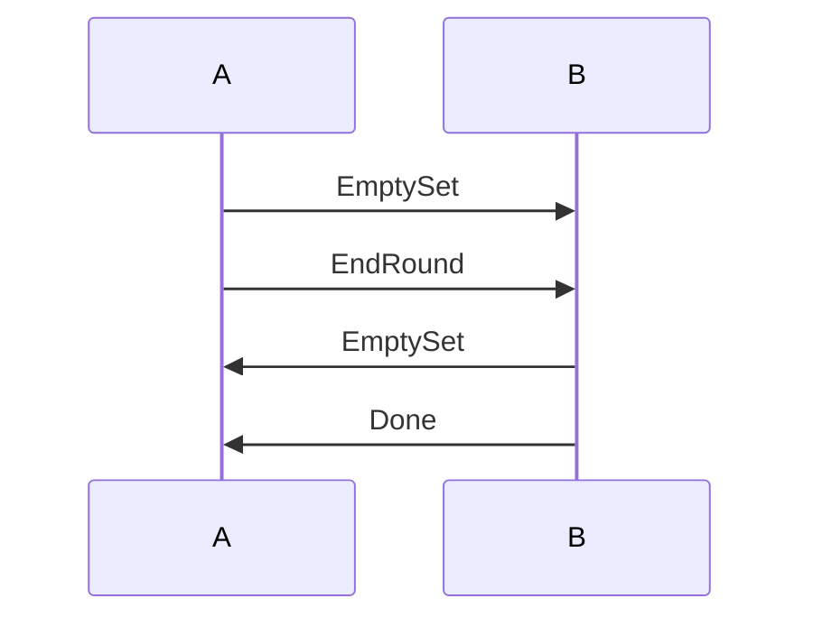
```mermaid
sequenceDiagram
  A->>B: EmptySet
  A->>B: EndRound
  B->>A: EmptySet
  B->>A: Done
```

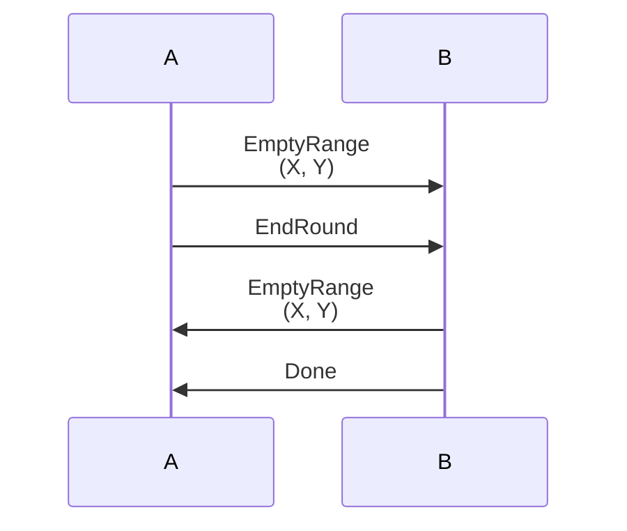
```mermaid
sequenceDiagram
  A->>B: EmptyRange <br/> (X, Y)
  A->>B: EndRound
  B->>A: EmptyRange <br/> (X, Y)
  B->>A: Done
```

Sync between an empty set (`A`) and a non-empty one (`B`).
```mermaid
sequenceDiagram
  A->>B: EmptySet
  A->>B: EndRound
  loop
    B->>A: ItemChunk <br/> (Items)
  end
  B->>A: Done
```

Sync between small ranges (`size <= maxSendRange`):
```mermaid
sequenceDiagram
  loop
    A->>B: ItemChunk <br/> (Items)
  end
  A->>B: RangeContents <br/> (X, Y, Count)
  A->>B: EndRound
  loop
    B->>A: ItemChunk <br/> (Items)
  end
  B->>A: Done
```

Sync between two equal sets:
```mermaid
sequenceDiagram
  A->>B: Fingerprint <br/> (X, Y, Count, Fingerprint)
  A->>B: EndRound
  Note over B: Fingerprint matches
  B->>A: Done
```

Sync between two different large enough sets:
```mermaid
sequenceDiagram
  A->>B: Fingerprint <br/> (X, Y, Count, Fingerprint)
  A->>B: EndRound
  Note over B: Range fingerprint differs <br/> Choose middle point m
  B->>A: Fingerprint <br/> (X, m, Count1, Fingerprint1)
  B->>A: Fingerprint <br/> (m, Y, Count2, Fingerprint2)
  B->>A: EndRound
  Note over A, B: ... more interactions ...
  A->>B: Done
```

Sync with failed MinHash check (sets too different). This causes the
reconciler to fall back to sending the contents of the whole range.
```mermaid
sequenceDiagram
  A->>B: Sample <br/> (X, Y, Count, Fingerprint, Items)
  A->>B: EndRound
  Note over B: MinHash diff <br/> is too large
  loop
    B->>A: ItemChunk <br/> (Items)
  end
  B->>A: RangeContents <br/> (X, Y, Count)
  B->>A: Done
```

Sync with successful MinHash check (acceptable difference).
Normal set reconciliation follows.
```mermaid
sequenceDiagram
  A->>B: Sample <br/> (X, Y, Count, Fingerprint, Items)
  A->>B: EndRound
  Note over B: MinHash diff <br/> is acceptable
  Note over B: Fingerprint is different from local one
  B->>A: Fingerprint <br/> (X, Y, Count, Fingerprint)
  B->>A: EndRound
  Note over A: Range fingerprint differs <br/> Choose middle point m
  A->>B: Fingerprint <br/> (X, m, Count1, Fingerprint1)
  A->>B: Fingerprint <br/> (m, Y, Count2, Fingerprint2)
  A->>B: EndRound
  Note over A, B: ... more interactions ...
  B->>A: Done
```

Sync with requested MinHash check and matching fingerprint and count (equal sets).
No further set reconciliation is necessary.
```mermaid
sequenceDiagram
  A->>B: Sample <br/> (X, Y, Count, Fingerprint, Items)
  A->>B: EndRound
  Note over B: Fingerprint matches
  B->>A: Done
```

Recent sync with MinHash check. After receiving the message of type
Recent, side B acts as if it was the initiating side in the previous
case.
```mermaid
sequenceDiagram
  Note over A: Send recently <br/> received items
  loop
    A->>B: ItemChunk <br/> (Items)
  end
  A->>B: Recent <br/> (Since)
  A->>B: EndRound
  Note over B: Send recently <br/> received items
  loop
    B->>A: ItemChunk <br/> (Items)
  end
  Note over B: The sample is taken <br/> after consuming <br/> the recent items from A
  B->>A: Sample <br/> (X, Y, Count, Fingerprint, Items)
  B->>A: EndRound
  Note over A: MinHash diff <br/> after consuming <br/> the recent items from B <br/> is acceptable
  A->>B: Fingerprint <br/> (X, Y, Count, Fingerprint)
  A->>B: EndRound
  Note over B: Range fingerprint differs <br/> Choose middle point m
  B->>A: Fingerprint <br/> (X, m, Count1, Fingerprint1)
  B->>A: Fingerprint <br/> (m, Y, Count2, Fingerprint2)
  B->>A: EndRound
  Note over A, B: ... more interactions ...
  A->>B: Done
```

Probe sequence. This is used to check how peers are different from
this one by the multipeer reconciliation algorithm, and does not
involve the actual sync.

```mermaid
sequenceDiagram
  A->>B: Probe <br> (X, Y, Fingerprint, SampleSize)
  A->>B: EndRound
  B->>A: Sample <br> (X, Y, Count, Fingerprint, Items)
  B->>A: Done
```

## Possible improvements

The following are some improvements to be considered for the set
reconciler. They may need a bit more thinking before being converted
to issues.

### Redundant ItemChunk messages

Another issue is `ItemChunk` messages. It would be much better to
receive the items (keys) in a streamed manner and just propagate them
to the respective handlers immediately.

### Range checksums

Right now, the set reconciliation protocol uses 12-byte fingerprints
all the time.  It should be possible, though, to use smaller
fingerprints, e.g. 4-byte (32-bit), and mitigate the possible
collisions by using checksums. One approach could be: when a range for
which fingerprint has been received turns out to be synced, its
fingerprint is XORed together with other such synced ranges from the
same round, and the resulting checksum is sent back as full 12 bytes
at the end of a new round as a part of `EndRound` or `Done` message.
The other peers checks which range fingerprints went unanswered (b/c
they're already synchronized), calculates the full fingerprint on its
side and compares it with the one received in `EndRound` / `Done`
message. If there's a mismatch, the synced range fingerprints are sent
again, this time with full fingerprints.
An important part of fingerprints is the need to use the lower bits of
each ID and not the higher bits which tend to be the same across
smaller ranges at higher recursive subdivision depths.

### Bloom filters for recent sync

The initial `Recent` message could carry a Bloom filter for recently
received items instead of all the items themselves. The peer could
then send back the items for which the filter check is negative,
followed by the initial peer sending the items it has for the same
time span that weren't received yet. While Bloom filters may have
false positives, this is not critical for the sync priming mechanism
as we don't need the sets to be exactly same after the recent sync; we
just want to bring them closer to each other. That being said, a
sufficient size of the Bloom filter needs to be chosen to minimize the
number of missed elements.
